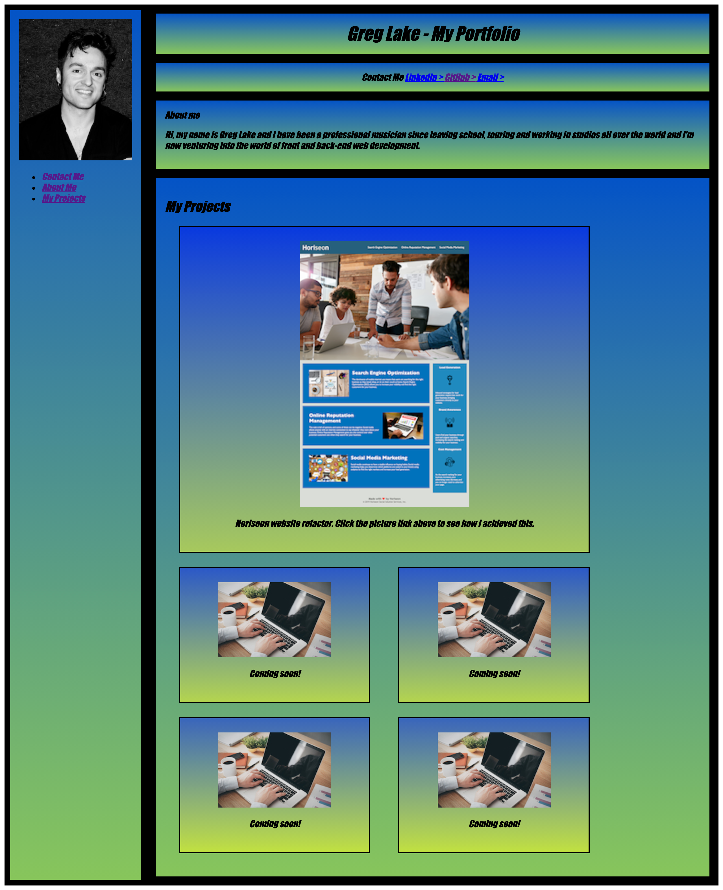

# Greg Lake's Personal Portfolio

Click [here](https://github.com/gplake79/Gregs_Personal_Portfolio) to view this project on GitHub pages.

## Description

Here I have created my own personal portfolio while following the guidelines regarding the acceptance criteria stipulated in the instructor README.md file.

## What did I do?

- WHEN a prospective employer loads my portfolio
  THEN they will be presented with my name, a recent photo, and links to sections about me, my work, and how to contact me.
- WHEN they click one of the links in the navigation THEN the UI scrolls to the corresponding section.
- WHEN they click on the link to the section about my work THEN the UI scrolls to a section with titled images of my applications.
- WHEN they are presented with my first application THEN that application's image is larger in size than the others.
- WHEN they click on the images of the applications THEN they are taken to that deployed application.
- WHEN they resize the page or view the site on various screens and devices
  THEN they am presented with a responsive layout that adapts to their viewport.

## Getting started

- Clone the GitHub project on you local machine.
- Navigate into the project.
- Open the project in VSCode.
- Open the 'index.html' file in your default browser.

git clone gplake79/Gregs_Personal_Portfolio
cd homework
code .

## Screenshot

